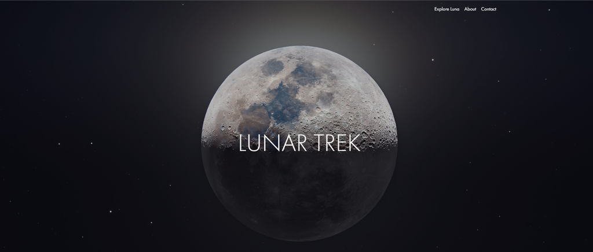
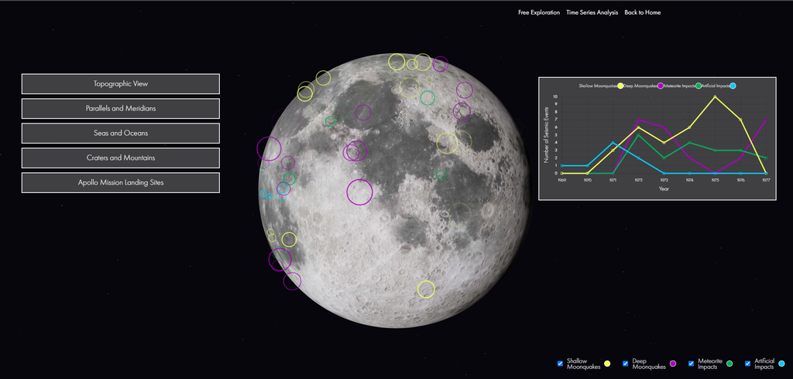
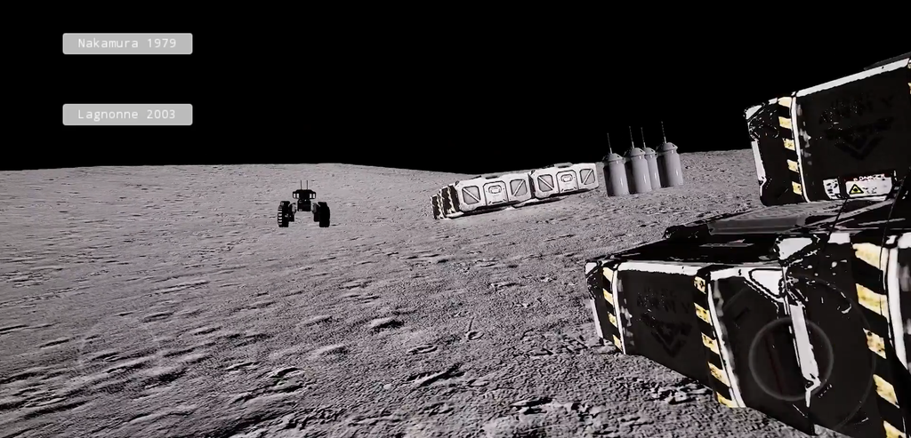

# Lunar Trek

The official award-winning repository for NASA Space Apps 2023 Lunar Trek, a website and a game that allows you to explore the moon and learn about the Apollo missions built for "Make a Moonquake Map 2.0!" challenge.

  

## Table of Contents
- [Lunar Trek](#lunar-trek)
  * [Table of Contents](#table-of-contents)
  * [Overview](#overview)
  * [Features](#features)
  * [Technologies Used](#technologies-used)
  * [Time Series Analysis](#time-series-analysis)
  * [Lunar Trek: The Game](#lunar-trek--the-game)
  * [Use of Artificial Intelligence](#use-of-artificial-intelligence)
  * [Contributors](#contributors)
  
## Overview
Our proposed solution addresses the challenge of visualizing lunar seismic data left behind by NASA's Apollo missions (Make a Moonquake Map 2.0!). We aim to create an engaging and informative experience for the public to understand and visualize seismic data through two interconnected components: a full-stack website and an immersive interactive game using Unreal Engine 5. The website will serve as a hub for users to explore lunar seismic data. It features an interactive 3D digital moon globe, where seismic events, including moonquake positions, can be visualized as pins. Users have access to time series analysis of moonquakes, helping them identify patterns and trends. In addition, informative content about moonquakes, differentiating them from earthquakes, are available to educate and engage users. The immersive game, powered by Unreal Engine 5, takes users to the lunar surface for a realistic moonquake experience. Users navigate the moon's terrain, experiencing the seismic events in real-time, and gain a deeper understanding of lunar seismic activity. This cutting-edge technology provides a visually stunning and engaging platform for users to interact with the moon's seismic data. Our solution addresses the challenge's requirements effectively. The website offers an intuitive interface for data exploration and analysis, making it accessible to a broad audience. The Unreal Engine 5-based game takes user engagement to the next level, allowing users to experience moonquakes firsthand. This multi-faceted approach caters to different learning styles and ensures that users gain a comprehensive understanding of lunar seismic activity.

## Features
Our website offers a comprehensive and immersive platform for users to delve into the intriguing world of moonquakes using NASA's seismic collected data. We provide an array of valuable information, including details on moonquake locations, heightmaps, and intensity, along with captivating visualizations of each affected area on the moon. Additionally, our website features in-depth time series analysis of moonquake data, allowing researchers and enthusiasts alike to uncover seasonality and trends within these seismic events.

Through our user-friendly website, you can effortlessly access precise details about moonquakes, including their exact position, magnitude, and detection date and time. Our platform also offers topographic views and latitude and longitude positions, providing a holistic understanding of moonquake occurrences across the lunar landscape. Additionally, you can explore features like seas, oceans, mountains, and even visualize Apollo landing sites, enhancing your lunar exploration experience.

## Technologies Used

To elevate the user experience, we've incorporated a high-quality moon simulation complete with a robotic explorer that can navigate the lunar surface and experience the impact of specific moonquakes. Our website is skillfully crafted using a blend of technologies, including:

- React
- Bootstrap
- CSS
- HTML
- Recharts.js

Moreover, we've harnessed cutting-edge technology such as Unreal Engine 5 to create a truly realistic lunar simulation.

## Time Series Analysis

  

Our website facilitates comprehensive time series analysis, allowing users to visualize the frequency of different moonquake types over the years. This analytical tool not only aids researchers in uncovering patterns and seasonal trends within seismic events but also captivates individuals with a general interest in aerospace and lunar phenomena.

## Lunar Trek: The Game

  

Lunar Trek represents a groundbreaking leap in lunar exploration, driven by the formidable Unreal Engine 5. This immersive experience transcends traditional boundaries, plunging users into an extraordinary realm where they can interact intimately with seismic data and explore the mysteries of moonquakes. The technology employed in Lunar Trek redefines how we engage with lunar phenomena, offering an unprecedented level of immersion and realism. It provides an educational and informative experience that is both unique and captivating, aimed at enlightening individuals about the fascinating world of moonquakes and lunar exploration.

## Use of Artificial Intelligence
Originally, we were fine-tuning a LLM model to answer space-based questions for the user using aerospace data we have gathered. This model serves as an important feature enhances its overall user experience. However, due to time constraints, we weren't able to integrate this model to our interactive website.

## Contributors
- [Yousef Kotp](https://github.com/yousefkotp)
- [Mohammed Helaly](https://github.com/MohammadHelaly)
- [Adham Mohammed](https://github.com/adhammohamed1)
- [Mohammed Farid](https://github.com/MohamedFarid612)
- [Yousef Walid](https://github.com/usefwalid)
- [Mohammed Ezzat](https://github.com/mohamedezzat2000z)
